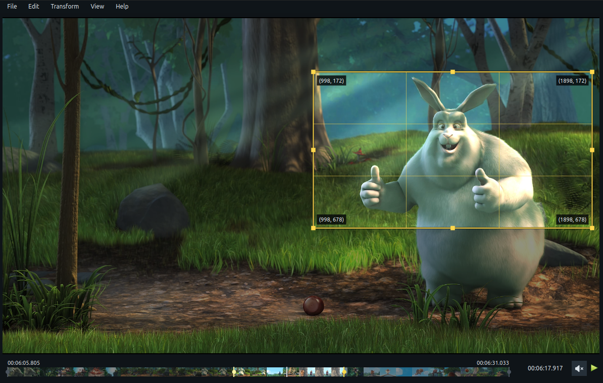

# Cropbox

A lightweight desktop utility for trimming, cropping, previewing, and exporting video and GIF media.



## Features

- MP4, MOV, MKV, WebM, and GIF preview
- Interactive crop overlay with draggable edges and handles
- Toggleable crop-coordinate and trim time/frame annotations
- Timeline trim in/out selection
- Exact timeline viewport start/end for precision trimming
- Draggable gray viewport handles alongside the yellow trim handles
- Exact trim-in and trim-out entry by timecode or frame number
- Dockable Info panel for editing playback, trim, and crop values
- Frame stepping and trim-handle nudging from the keyboard
- Playback speed control for preview and export
- Export dialog with format, size, quality, and audio presets
- Remembered export settings and output folder
- FFmpeg export to MP4, MOV, and GIF
- Headless CLI export with media, trim, and crop options
- Python 3.8–3.12
- PySide6 desktop UI

## Requirements

- Python 3.8 through 3.12
- `ffmpeg`
- `ffprobe`

CropBox checks for `ffmpeg` and `ffprobe` on startup and provides install guidance from `Help -> Install FFmpeg`.

Typical install on Ubuntu/Debian:

```bash
sudo apt install ffmpeg
```

## Controls

- Space: play/pause
- Ctrl+I: toggle the Info panel
- Left/Right: step one frame
- Shift+Left/Right: nudge selected trim handle by one frame
- Ctrl+Left/Right: nudge selected timeline viewport handle by one frame

## Menus

- File: Open, Export, Quit
- Edit: Set Trim In, Set Trim Out, Reset Trim, Reset Timeline, Create Crop, Reset Crop, Playback Speed, Loop Playback
- View: Info Panel, Show Annotations
- Help: Install FFmpeg, About Cropbox

## Install

Install the latest release from PyPI:

```bash
pip install cropbox
```

Or install from a local source checkout:

```bash
pip install .
```

## Run

```bash
cropbox
```

Open media immediately:

```bash
cropbox input.mp4
```

Open with initial trim and crop values:

```bash
cropbox input.mp4 --trim-in 12.5 --trim-out 00:00:20.000 --crop 100 50 1280 720
```

Export directly without opening the UI:

```bash
cropbox big_buck_bunny_1080p_h264.mov -o big_buck_bunny.mp4
```

Export with trim and crop values:

```bash
cropbox input.mp4 --out output.mp4 --trim-in 12.5 --trim-out 20 --crop 100 50 1280 720
```

## CLI Options

- `-o, --out PATH`: export directly to MP4, MOV, or GIF without opening the UI
- `-f, --force`: overwrite an existing `--out` file
- `--trim-in`: initial trim-in time in seconds or `HH:MM:SS.mmm`
- `--trim-out`: initial trim-out time in seconds or `HH:MM:SS.mmm`
- `--crop X Y WIDTH HEIGHT`: initial crop rectangle in source pixels

## Notes

- Playback speed affects both preview and export.
- Headless export defaults to the full media duration when `--trim-out` is omitted.
- Export size presets preserve the cropped aspect ratio and report the resulting dimensions.
- High, Balanced, and Smaller File presets control H.264 quality or GIF palette size.
- Exact trim-in and trim-out values can also be entered from the Edit menu.
- Press Enter in an Info panel field to apply current time/frame, playback FPS, trim, timeline viewport, or crop changes.
- Timeline Start and End zoom the visible timeline, but cannot exclude the trim range; expanding trim automatically expands the timeline viewport.
- Gray viewport-handle drags preview against the current timeline and apply on mouse release.
- Reset Timeline restores the full media duration.
- The playhead is constrained to the active trim range.
